# Antigravity Live Share

Real-time collaborative development for the Antigravity IDE.

Antigravity Live Share aims to bring a Live Share-style experience to Antigravity, allowing developers to collaborate on the same project in real time without constantly sending files, using screen sharing, or manually synchronizing changes.

## 🚀 Vision

The goal is to make collaborative coding as simple as:

1. Start a session.
2. Share an invite link.
3. Your teammate joins.
4. Start coding together.

                 Antigravity IDE
                       │
                       ▼
              ┌─────────────────┐
              │  Live Share     │
              │     Plugin      │
              └────────┬────────┘
                       │
                       ▼
              ┌─────────────────┐
              │ Live Share      │
              │ Sidecar         │
              │                 │
              │ WebSocket/CRDT  │
              └────────┬────────┘
                       │
                       ▼
                Collaboration
                   Server

```mermaid
flowchart LR
    subgraph IDE["🖥️ Antigravity IDE"]
        direction TB
        LS["🟢 Live Share"]
        START["▶️ Start Session"]

        LS --> START
    end

    START -->|"Create Session"| SERVER

    subgraph COLLAB["☁️ Collaboration Layer"]
        direction TB
        SERVER["🔄 Collaboration Server"]
        SYNC["⚡Real-Time Synchronization"]

        SERVER --> SYNC
    end

    SYNC -->|"WebSocket"| HOST
    SYNC -->|"WebSocket"| GUEST

    subgraph USERS["👥 Session Participants"]
        direction LR
        HOST["👨‍💻 Host"]
        GUEST["👩‍💻 Guest"]
    end

    HOST <-->|"Code Changes<br/>Cursor Position<br/>Selections<br/>Events"| GUEST

    style IDE fill:#111827,color:#ffffff,stroke:#374151,stroke-width:2px
    style COLLAB fill:#1e1b4b,color:#ffffff,stroke:#6366f1,stroke-width:2px
    style USERS fill:#0f172a,color:#ffffff,stroke:#475569,stroke-width:2px

    style LS fill:#166534,color:#ffffff,stroke:#22c55e,stroke-width:2px
    style START fill:#2563eb,color:#ffffff,stroke:#60a5fa,stroke-width:2px
    style SERVER fill:#7c3aed,color:#ffffff,stroke:#a78bfa,stroke-width:2px
    style SYNC fill:#9333ea,color:#ffffff,stroke:#c084fc,stroke-width:2px
    style HOST fill:#0369a1,color:#ffffff,stroke:#38bdf8,stroke-width:2px
    style GUEST fill:#15803d,color:#ffffff,stroke:#4ade80,stroke-width:2px
```

## How It Works

1. **Start Live Share** — The user opens Antigravity IDE and starts a Live Share session.
2. **Create Session** — A collaboration session is created through the collaboration server.
3. **Connect Participants** — The Host and Guest connect to the collaboration session.
4. **Real-Time Synchronization** — The server synchronizes collaboration events between participants.
5. **Collaborate** — Code changes, cursor positions, selections, and other events are synchronized in real time.
